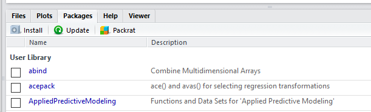

Introduction to Data Science with R
========================================================
author: John Johnson
date: 6/15/2016
autosize: true

High-level outline
========================================================
type: section
incremental: true

- Goal and Assumptions
- Where to get R
- Packages
- Demo

Goal
========================================================

To bring you from ground zero to analyzing data with R as fast as possible

- With access to a computer
- And some ideas about programming/procedural programming
- And some motivation
- But not a lot of time (will gloss over a *lot* of details)

Where to get R
========================================================

- R - http://www.r-project.org
- RStudio - http://www.rstudio.com (Why? Easier interface, code editing tools, easy to set up, enhances productivity in R, and much, much, more)

Packages
========================================================

```
install.packages("package_name")
```
or use R or RStudio's package interface



What package to use?

http://cran.r-project.org (browse or use [Task views](https://cran.r-project.org/web/views/)). There are nearly 9,000 packages, most for special types of analysis, but some (e.g. `dplyr`, `ggplot2`, or `Hmisc`) are general use. They also vary in quality - look for quality of documentation, mentions in R community, books associated with them, last update date, etc. Note using `install.packages` or package interface will install dependencies automatically.

This talk uses `readr`, `dplyr`, and `ggplot2`. Use `install.packages(c("dplyr","ggplot2","readr"))` with an internet connection to get them.

Making packages available
========================================================

Use `library(package)` to make it available in your R environment.

Getting help
========================================================

- Help system: `F1`, `?`, and `help.search` - contains technical details of commands, options, etc. and some simple examples
- Vignettes - comes with some packages: `browseVignettes("package")` - contain more sophisticated examples, use cases, and practical explanations, but not all packages have them
- Cross-validated 
- http://www.r-bloggers.com
- books (both R help and specialized packages such as ggplot2)
- and much, much more.

Demo
========================================================
type: section

Where to go for more
========================================================

- [David Langer](http://www.youtube.com/watch?v=32o0DnuRjfg) - David Langer is an IT professional from Microsoft, and has a 5 part series
- [Johns Hopkins data science program](https://www.coursera.org/specializations/jhu-data-science) - Good if you have some cash and want a high quality introduction to data science with R and best practices
